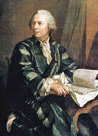

chapitre 10

C'est le mathématicien suisse Leonhard Euler (1707-1783) utilisa pour la première fois la notation e.
La première apparition de la lettre « e » pour désigner la base
 du logarithme népérien date de 1728, dans un manuscrit d'Euler 
 qui le définit comme le nombre dont le logarithme est l'unité et 
 qui se sert des tables de Vlacq pour l'évaluer à 2,7182817.
 
 